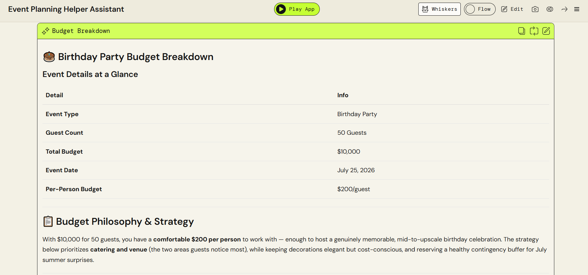
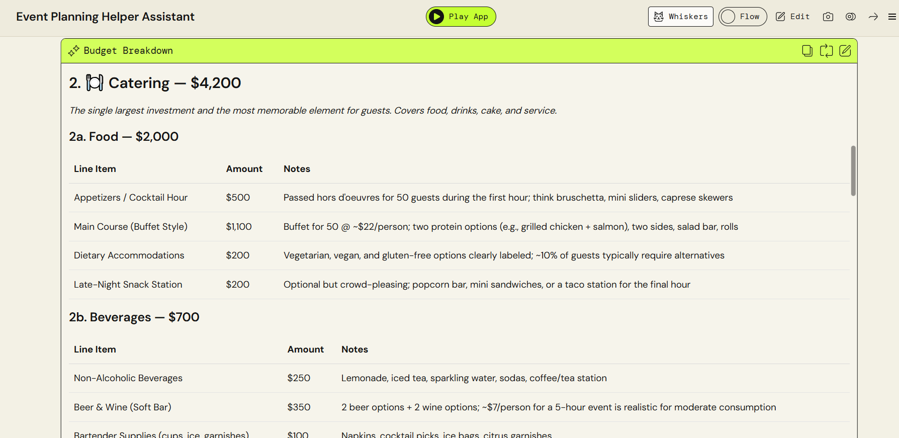
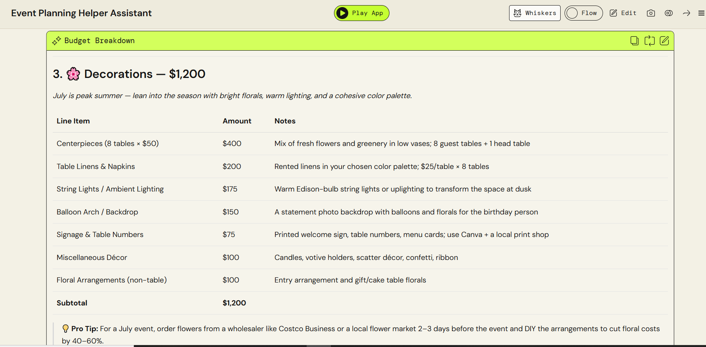

# Budget Breakdown 💰

This section shows how the AI divides the budget into categories.

## Includes:

* Venue cost
* Food & catering
* Entertainment
* Decorations
* Miscellaneous expenses

## Screenshot

## Purpose

This helps users understand how to distribute their budget effectively for the event.

