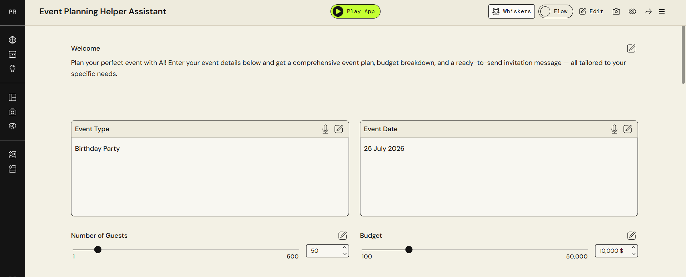

# Input Section 📥

This section shows the input interface of the Event Planning Helper app.

## What users enter:

* Event Type (e.g., Wedding, Meeting, Party)
* Number of Guests
* Budget
* Event Date

## Screenshot

## Purpose

This input section allows users to define the main details needed for the AI to generate a complete event plan.

